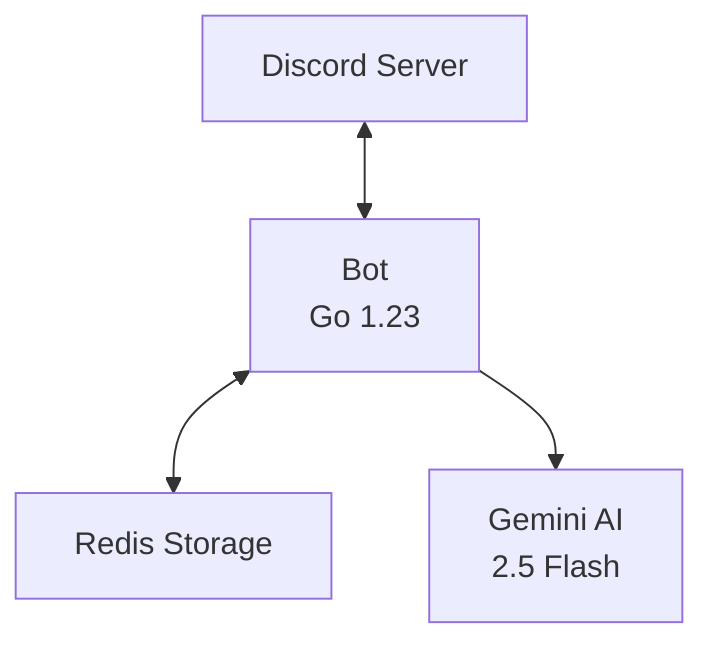

# Project Summary

A versatile Discord bot that monitors multiple RSS feeds and posts AI-generated summaries to configured channels with flexible time-based scheduling. Supports any RSS-enabled source including blogs, news sites, game engines, and developer communities.

## Architecture



### Components

**Bot Core** (`internal/bot/`)
- Slash command handlers for feed and channel management
- Time-based scheduling per feed (HH:MM format)
- Multi-feed support with independent processing
- Multilingual support with smart channel grouping
- Language preference hierarchy: channel → guild → en (English)
- 5-article pending queue per feed
- Permission validation (Manage Server required)

**Storage** (`internal/storage/`)
- Redis persistence with 5-second timeout
- Channel-Feed many-to-many relationships (SET)
- Feed repository with CRUD operations (HASH)
- Language preferences at guild and channel levels (STRING)
- Per-feed schedules (LIST)
- Per-feed pending queues (LIST, max 5 articles)
- Per-feed article history (STRING with 90-day TTL)

**Feed Management** (`internal/storage/`)
- FeedRepository: Register/unregister feeds
- Feed metadata: ID, URL, Title, Description, AddedAt, Schedule
- Schedule validation (24-hour HH:MM format)
- Many-to-many channel-feed associations

**AI Summarization** (`internal/ai/`)
- Google Gemini 2.5 Flash
- Multilingual generation in 6 languages (pt-BR, en, es, fr, de, ja)
- JSON response format with translated titles and summaries
- Language-specific prompts with tone instructions
- Single API call for title translation (cost-efficient)
- 1500 max tokens, 5-minute timeout
- Enhanced logging (input length, API timing, finish reason)
- Smart grouping: one summary per language, shared across channels
- Title validation and truncation (max 256 chars for Discord)

**RSS Processor** (`internal/news/`)
- gofeed v1.3.0 for parsing
- go-readability for HTML extraction
- Per-feed GUID-based deduplication

**Cost Management** (`internal/ratelimit/`)
- Rate limiting (10 RPM, 200k TPM defaults)
- Token counting before requests
- Circuit breaker pattern (5 failure threshold)
- Exponential backoff retry (up to 3 attempts)
- Real-time statistics and monitoring

## Tech Stack

- **Language**: Go 1.23+ with generics
- **Storage**: Redis 7 (go-redis v9.17.2)
- **AI**: Google Gemini 2.5 Flash
- **RSS**: gofeed v1.3.0, go-readability
- **Testing**: testify with miniredis v2.35.0
- **Deployment**: Docker multi-stage build (~15MB)

## Testing

**55 tests** across all packages with miniredis in-memory mocks:

```bash
go test ./...        # Run all tests
go test -cover ./... # With coverage
```

**Coverage:**
- Rate limiting: 94.0%
- AI: 56.5%
- Storage: 60.2%
- News: 65.5%

## Commands

| Command | Description | Permission |
|---------|-------------|------------|
| `/setup-news #channel [feed]` | Subscribe channel to feed (defaults to godot-official) | Manage Server |
| `/remove-news #channel [feed]` | Unsubscribe channel from feed | Manage Server |
| `/list-channels` | List all channels and their subscriptions | Manage Server |
| `/update-news [feed]` | Force immediate check of specific feed (defaults to godot-official) | Manage Server |
| `/update-all-news` | Force immediate check of all feeds | Manage Server |
| `/register-feed <id> <url> [title] [desc]` | Register new RSS feed | Manage Server |
| `/unregister-feed <id>` | Remove RSS feed | Manage Server |
| `/list-feeds` | Show all registered feeds with schedules | Anyone |
| `/schedule-feed <id> <times>` | Set check times (e.g., 09:00,13:00,18:00) | Manage Server |
| `/set-language <language>` | Set default language for server (pt-BR/en/es/fr/de/ja) | Manage Server |
| `/set-channel-language #channel [lang]` | Override language for specific channel | Manage Server |
| `/help` | Display all available commands with descriptions | Anyone |

### GitHub Repository Monitoring

| Command | Description | Permission |
|---------|-------------|------------|
| `/register-repo <id> <owner> <repo> [branch]` | Register GitHub repository to monitor PRs | Manage Server |
| `/unregister-repo <id>` | Remove GitHub repository | Manage Server |
| `/list-repos` | Show all registered repositories with stats | Manage Server |
| `/setup-repo-channel #channel <id>` | Subscribe channel to PR summaries (use repo ID) | Manage Server |
| `/remove-repo-channel #channel <id>` | Unsubscribe channel from PR summaries (use repo ID) | Manage Server |
| `/schedule-repo <id> <times>` | Set check times for repository (use repo ID, e.g., 09:00,13:00,18:00) | Manage Server |

**GitHub Features:**
- Monitor merged Pull Requests from specified repositories
- High-value filtering (by labels, changed files, min changes)
- Auto-categorization (Features, Bugfixes, Performance, UI/UX, Security)
- Batched AI-generated summaries with "Why it matters" explanations
- **Multilingual support** (same 6 languages as RSS feeds: pt-BR, en, es, fr, de, ja)
- **Smart grouping**: One summary per language, shared across channels
- **Language detection**: Uses channel → guild → English hierarchy
- Time-based scheduling per repository (same as RSS feeds)
- Many-to-many channel subscriptions
- Deduplication with 90-day memory
- Configurable batch threshold and check interval

## Configuration

```env
# Required
DISCORD_TOKEN=your_token
GEMINI_API_KEY=your_key

# Bot Settings (Optional)
MAX_CHANNELS_LIMIT=5
CHECK_INTERVAL_MINUTES=15           # Fallback for feeds without schedules
REDIS_URL=localhost:6379
REDIS_PASSWORD=

# GitHub Integration (Optional)
GITHUB_TOKEN=your_github_pat                     # GitHub Personal Access Token
GITHUB_CHECK_INTERVAL_MINUTES=30                 # Fallback for repos without schedules
GITHUB_BATCH_THRESHOLD=5                         # PRs needed to trigger summary
GITHUB_FILTER_MIN_CHANGES=5                      # Minimum line changes for filtering

# Rate Limiting (Optional - Gemini Free Tier Protection)
GEMINI_MAX_REQUESTS_PER_MINUTE=10        # Conservative: below 15 RPM limit
GEMINI_MAX_TOKENS_PER_MINUTE=200000      # Conservative: below 250k TPM limit
GEMINI_MAX_TOKENS_PER_REQUEST=4000       # Safe per-request limit
GEMINI_CIRCUIT_BREAKER_THRESHOLD=5       # Failures before circuit opens
GEMINI_CIRCUIT_BREAKER_TIMEOUT_MINUTES=5 # Wait time after circuit opens
GEMINI_RETRY_ATTEMPTS=3                  # Number of retry attempts
GEMINI_RETRY_BACKOFF_SECONDS=1           # Base backoff duration
```

## Redis Schema

```
# Channels & Feeds
news:channels                     → SET of channel IDs
news:channels:{channelID}:feeds   → SET of feed identifiers
news:feeds:{feedID}:channels      → SET of channel IDs

# Feed Management
news:feeds:{feedID}               → HASH (url, title, description, added_at)
news:feeds:{feedID}:schedule      → LIST of check times (HH:MM)
news:feeds:{feedID}:pending       → LIST of article GUIDs (max 5)
news:feeds:{feedID}:history:{guid}→ STRING "posted" (90-day TTL)

# Language Preferences
news:guilds:{guildID}:language    → STRING (language code, default: pt-BR)
news:channels:{channelID}:language→ STRING (optional override)

# GitHub Repository Monitoring
github:repos:{repoID}               → HASH (owner, name, target_branch, added_at)
github:repos:{repoID}:schedule      → LIST of check times (HH:MM format)
github:repos:{repoID}:processed     → SET of PR IDs (90-day TTL)
github:repos:{repoID}:pending       → LIST of JSON-serialized PRs
github:repos:{repoID}:channels      → SET of channel IDs
github:channels:{channelID}:repos   → SET of repo IDs
github:repos:{repoID}:last_checked  → Unix timestamp
```

### Language Detection Flow
1. Check `news:channels:{channelID}:language` for channel-specific override
2. If not set, get guild ID and check `news:guilds:{guildID}:language`
3. If not set, default to "en" (English)
4. Group channels by language before generating summaries

## Development

**TDD Workflow:**
1. Write failing test
2. Implement minimal code to pass
3. Refactor while keeping tests green

**Dependencies:**
```bash
go mod download
```

**Run locally:**
```bash
go run ./cmd/bot
```

**Docker:**
```bash
docker-compose up --build
```

## Features

### Core Functionality
- ✅ Channel-based subscription with # parameters
- ✅ AI-powered summaries in 6 languages (pt-BR, en, es, fr, de, ja)
- ✅ Translated article titles alongside summaries
- ✅ JSON-based AI responses for reliable parsing
- ✅ Multilingual support with smart channel grouping
- ✅ Language preferences at guild and channel levels
- ✅ Displays both original and translated titles (when different)
- ✅ Pending queue (max 5 articles when no channels)
- ✅ Validation (update-news requires ≥1 channel)
- ✅ Docker deployment with Redis persistence
- ✅ Enhanced logging for debugging

### Cost Management & Reliability
- ✅ **Token counting** - Estimates before each request
- ✅ **Rate limiting** - 10 RPM / 200k TPM (33% safety buffer)
- ✅ **Circuit breaker** - Opens after 5 failures, 5-min timeout
- ✅ **Automatic retries** - Up to 3 attempts with exponential backoff
- ✅ **Smart retry logic** - Retries 429/503, skips 400/401/403/404
- ✅ **Wait-for-capacity** - Blocks gracefully when limits reached
- ✅ **Statistics API** - Real-time usage monitoring

### Quality Assurance
- ✅ 55 passing tests (94% coverage on rate limiting)
- ✅ Thread-safe concurrent access
- ✅ Comprehensive error handling
- ✅ TDD architecture

## Cost Management System

### Overview
Protects against exceeding Gemini API free tier limits with:
- Token counting before requests (fallback: chars/4)
- Request & token rate limiting per minute
- Circuit breaker pattern for outage protection
- Exponential backoff retry (1s → 2s → 4s → 8s)

### Gemini Free Tier Limits
- **15 RPM** (Requests Per Minute)
- **250k TPM** (Tokens Per Minute)

### Bot Defaults (Conservative)
- **10 RPM** (33% buffer below limit)
- **200k TPM** (20% buffer below limit)
- **4k tokens per request** (reasonable article + summary)

### Error Handling
**Retryable errors:**
- 429 (rate limit)
- 503 (service unavailable)
- Timeout/deadline exceeded
- Connection errors

**Non-retryable errors:**
- 400 (bad request)
- 401 (unauthorized)
- 403 (forbidden)
- 404 (not found)

### Monitoring
Logs include:
```
Rate Limiting: 10 RPM, 200000 TPM, Circuit Breaker: 5 failures
Token estimate: input=1234, estimated_output=1500, total=2734
Request successful, recorded 2850 tokens
```

Access statistics programmatically:
```go
stats := summarizer.GetRateLimitStatistics()
// stats.CurrentWindowRequests, stats.CurrentWindowTokens
// stats.TotalRequests, stats.TotalTokens, stats.TotalFailures
// stats.CircuitOpen
```

### Benefits
- **Cost protection** - Never exceed free tier
- **Reliability** - Automatic retries and circuit breaker
- **Transparency** - Detailed logging and statistics
- **Configurability** - All limits adjustable via .env
- **No breaking changes** - Backward compatible

## License

MIT License
